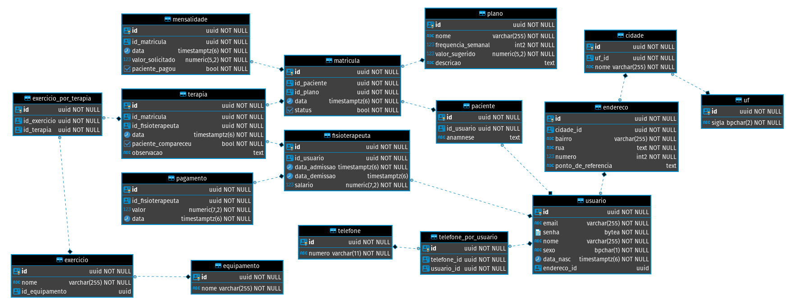

# Projeto de Modelagem de Dados - Clínica de Fisioterapia


Projeto final da disciplina de Arquitetura e Modelagem de Dados - BD FATEC 2020

Aluno: Matheus Rocha da Silva - RA: 1460281823034

## Introdução


O famoso Dr. Hans Chucrute contratou uma empresa de desenvolvimento de software para automatizar os processos administrativos da sua clínica de fisioterapia.

O cliente gostaria de que fosse construído um banco de dados, pois atualmente tudo é organizado de forma manual, com uma agenda física, que é facilmente suscetível a erros.

## Levantamento de Requisitos

Depois de conversar com o cliente, foram levantadas as seguintes informações:

- É necessário guardar informações básicas, que são comuns tanto aos pacientes, quanto aos fisioterapeutas. São elas:
  - Nome, obrigatório;
  - E-mail, obrigatório e único, será utilizado para logar no futuro sistema web;
  - Senha, obrigatória;
  - Data de nascimento, obrigatória;
  - Sexo, obrigatório;
  - Telefones para contato, pelo menos um;
  - Endereço, opcional;
    - Não foram especificados os campos do endereço;
- Todo paciente possui um diagnóstico inicial, mas o doutor prefere usar o termo [anamnese](<https://pt.wikipedia.org/wiki/Anamnese_(sa%C3%BAde)>), pois soa mais profissional.
- Para os fisioterapeutas, é preciso guardar:
  - Data de admissão, obrigatória;
  - Data de demissão, opcional;
  - Salário, obrigatório;
  - Datas dos pagamentos e quanto foi pago;
- Atualmente a clínica só trabalha com três tipos de planos, terapia manual, pilates e RPG (não é o de mesa). Os planos possuem:
  - Nome, obrigatório;
  - Frequência semanal, obrigatória;
  - Uma descrição, opcional;
  - Um valor sugerido de mensalidade, obrigatório;
- Um paciente pode se matricular em quantos planos quiser, assim como um fisioterapeuta pode atender em qualquer plano;
- É necessário guardar a data da matrícula e se ela está ativa ou não;
- Para cada matrícula, será gerada uma mensalidade, que deve conter:
  - O valor solicitado, obrigatório;
  - O valor pago, obrigatório;
  - A data da mensalidade, obrigatória;
  - Um comentário opcional;
- Cada sessão de terapia precisa conter:
  - Qual paciente foi atendido, obrigatório;
  - Qual fisioterapeuta atendeu, obrigatório;
  - A data em que a sessão ocorreu, obrigatória;
  - Se o paciente compareceu, obrigatório;
  - Um comentário opcional;
- O doutor também mencionou que, para fins estatísticos, seria interessante anotar quais exercícios foram feitos em cada sessão, porém é importante ter em mente que nem toda sessão tem exercícios, como por exemplo a primeira, onde só é feita uma entrevista com o paciente.
- Quanto ao exercício:
  - Possui um nome, obrigatório;
  - Pode utilizar um equipamento, que também possui um nome, obrigatoriamente;

## Modelo Conceitual


_<https://github.com/mrocha98/projeto-modelagem-de-dados/blob/master/Assets/modelo-conceitual.jpg>_

## Modelo Lógico (teórico)


_<https://github.com/mrocha98/projeto-modelagem-de-dados/blob/master/Assets/modelo-logico.jpg>_

## Modelo Lógico (prático)

Durante o desenvolvimento optei por transformar todos identificadores em Unique Keys e criei colunas ID como primary key.

Segue modelo lógico gerado pelo software DBeaver Community após a execução do [Script DLL.sql](./Scripts/DLL.sql).


_<https://github.com/mrocha98/projeto-modelagem-de-dados/blob/master/Assets/dbeaver-diagram.png>_

## SQL


Para o banco de dados, optei pelo Postgres, por ser muito fácil de utilizar com o Docker.

Todos os códigos estão disponíveis nesse repositório do Github:

<https://github.com/mrocha98/projeto-modelagem-de-dados>.

### DDL

```sql
create table if not exists UF (
	id uuid not null,
	sigla char(2) not null,
	constraint PK_UF primary key (id),
	constraint UK_UF unique (sigla)
);


create table if not exists Cidade (
	id uuid not null,
	UF_id uuid not null,
	nome varchar(255) not null,
	constraint PK_Cidade primary key (id),
	constraint FK_Cidade_UF foreign key (UF_id) references UF(id),
	constraint UK_Cidade unique (UF_id, nome)
);


create table if not exists Endereco (
	id uuid not null,
	cidade_id uuid not null,
	bairro varchar(255) not null,
	rua text not null,
	numero smallint not null,
	ponto_de_referencia text null,
	constraint PK_Endereco primary key (id),
	constraint FK_Endereco_Cidade foreign key (cidade_id) references cidade (id),
	constraint UK_Endereco unique (cidade_id, bairro, rua, numero)
);

create table if not exists Telefone (
	id uuid not null,
	numero varchar(11) not null,
	constraint PK_Telefone primary key (id),
	constraint UK_Telefone unique(numero)
);


create table if not exists Usuario (
	id uuid not null,
	email varchar(255) not null,
	senha bytea not null,
	nome varchar(255) not null,
	sexo char(1) not null,
	data_nasc timestamptz not null,
	endereco_id uuid null,
	constraint PK_Usuario primary key (id),
	constraint FK_Usuario_Endereco foreign key (endereco_id) references Endereco (id),
	constraint UK_Usuario unique (email),
	constraint CK_Usuario_sexo check (sexo = 'M' or sexo = 'F')
);

create table if not exists Telefone_Por_Usuario (
	id uuid not null,
	telefone_id uuid not null,
	usuario_id uuid not null,
	constraint PK_Telefone_Por_Usuario primary key (id),
	constraint FK_Telefone_Por_Usuario_Telefone foreign key (telefone_id) references Telefone (id),
	constraint FK_Telefone_Por_Usuario_Usuario foreign key (usuario_id) references Usuario (id),
	constraint UK_Telefone_Por_Usuario unique (telefone_id, usuario_id)
);

create table if not exists Fisioterapeuta (
	id uuid not null,
	id_usuario uuid not null,
	data_admissao timestamptz not null,
	data_demissao timestamptz null,
	salario numeric(7, 2) not null,
	constraint PK_Fisioterapeuta primary key (id),
	constraint FK_Fisioterapeuta_Usuario foreign key (id_usuario) references Usuario (id),
	constraint UK_Fisioterapeuta unique (id_usuario),
	constraint CK_Fisioterapeuta_salario check (salario > 0)
);

create table if not exists Paciente (
	id uuid not null,
	id_usuario uuid not null,
	anamnese text null,
	constraint PK_Paciente primary key (id),
	constraint FK_Paciente_Usuario foreign key (id_usuario) references Usuario (id),
	constraint UK_Paciente unique (id_usuario)
);

create table if not exists Pagamento (
	id uuid not null,
	id_fisioterapeuta uuid not null,
	data timestamptz not null,
	valor numeric(7, 2) not null,
	constraint PK_Pagamento primary key (id),
	constraint FK_Pagamento_Fisioterapeuta foreign key (id_fisioterapeuta) references Fisioterapeuta(id),
	constraint UK_Pagamento unique (id_fisioterapeuta, data)
);


create table if not exists Plano (
	id uuid not null,
	nome varchar(255) not null,
	frequencia_semanal smallint not null,
	valor_sugerido numeric (5, 2) not null,
	descricao text null,
	constraint PK_Plano primary key (id),
	constraint UK_Plano unique (nome, frequencia_semanal),
	constraint CK_Plano_valor_sugerido check (valor_sugerido >= 0)
);

create table if not exists Matricula (
	id uuid not null,
	id_paciente uuid not null,
	id_plano uuid not null,
	data timestamptz not null,
	status bool not null,
	constraint PK_Matricula primary key (id),
	constraint FK_Matricula_Paciente foreign key (id_paciente) references Paciente (id),
	constraint FK_Matricula_Plano foreign key (id_plano) references Plano (id),
	constraint UK_Matricula unique (id_paciente, id_plano)
);

create table if not exists Mensalidade (
	id uuid not null,
	id_matricula uuid not null,
	data timestamptz not null,
	valor_solicitado numeric (5, 2) not null,
	paciente_pagou bool not null,
	constraint PK_Mensalidade primary key (id),
	constraint FK_Mensalidade_Matricula foreign key (id_matricula) references Matricula (id),
	constraint UK_Mensalidade unique (id_matricula, data)
);


create table if not exists Equipamento (
	id uuid not null,
	nome varchar(255) not null,
	constraint PK_Equipamento primary key (id),
	constraint UK_Equipamento unique (nome)
);

create table if not exists Exercicio (
	id uuid not null,
	nome varchar(255) not null,
	id_equipamento uuid null,
	constraint PK_Exercicio primary key (id),
	constraint RK_Exercicio_Equipamento foreign key (id_equipamento) references Equipamento (id),
	constraint UK_Exercicio unique (nome)
);

create table if not exists Terapia (
	id uuid not null,
	id_matricula uuid not null,
	id_fisioterapeuta uuid not null,
	data timestamptz not null,
	paciente_compareceu bool not null,
	observacao text null,
	constraint PK_Terapia primary key (id),
	constraint FK_Terapia_Matricula foreign key (id_matricula) references Matricula (id),
	constraint FK_Terapia_Fisioterapeuta foreign key (id_fisioterapeuta) references Fisioterapeuta (id),
	constraint UK_Terapia unique (id_matricula, id_fisioterapeuta, data)
);

create table if not exists Exercicio_Por_Terapia (
	id uuid not null,
	id_exercicio uuid not null,
	id_terapia uuid not null,
	constraint PK_Exercicio_Por_Terapia primary key (id),
	constraint FK_Exercicio_Por_Terapia_Exercicio foreign key (id_exercicio) references Exercicio (id),
	constraint FK_Exercicio_Por_Terapia_Terapia foreign key (id_terapia) references Terapia (id),
	constraint UK_Exercicio_Por_Terapia unique (id_exercicio, id_terapia)
);
```

## DML

Os dados inseridos estão no [script DML.sql](https://github.com/mrocha98/projeto-modelagem-de-dados/blob/master/Scripts/DML.sql). Não criei um preview com eles pois o arquivo contêm mais de 700 linhas.

## DQL

```sql
-- Dados de todos os usuários
select usr.nome, usr.sexo, date(usr.data_nasc) as data_nasc, tel.numero as telefone, concat(endr.rua, ', ', endr.numero, ' - ', endr.bairro) as endereco, cid.nome as cidade, uf.sigla as UF
from usuario usr
inner join telefone_por_usuario tel_p_usr on usr.id = tel_p_usr.usuario_id
left join telefone tel on tel.id = tel_p_usr.telefone_id
left join endereco endr on usr.endereco_id = endr.id
inner join cidade cid on endr.cidade_id = cid.id
inner join uf on cid.uf_id = uf.id
order by usr.nome ASC;

-- Total de usuários por sexo
select sexo, count(sexo) as total
from usuario
group by sexo;

-- Montante total de pagamentos recebidos e qtd de vezes em que recebeu
select usr.nome, sum(pag.valor) as montante, count(pag.id) as qtd
from usuario usr
inner join fisioterapeuta fisio on usr.id = fisio.id_usuario
inner join pagamento pag on pag.id_fisioterapeuta = fisio.id
group by usr.nome
order by usr.nome ASC;

-- Pacientes e seus diagnósticos
select usr.nome, pac.anamnese
from usuario usr
inner join paciente pac on usr.id = pac.id_usuario
order by usr.nome asc;


-- Matrículas
select usr.nome as paciente, plan.nome as plano, plan.frequencia_semanal as freq_sem, mat.status, mat.data
from usuario usr
inner join paciente pac on usr.id = pac.id_usuario
inner join matricula mat on pac.id = mat.id_paciente
inner join plano plan on plan.id= mat.id_plano
order by usr.nome asc;


-- Quantidade de matrículas ativas por plano
select plan.nome as plano, count(mat.id) as qtd
from usuario usr
inner join paciente pac on usr.id = pac.id_usuario
inner join matricula mat on pac.id = mat.id_paciente
inner join plano plan on plan.id= mat.id_plano
group by plan.nome, mat.status
having mat.status = true
order by plan.nome ASC;


-- Pacientes que moram na Av. Andrômeda, Residencial Jardim Satélite - São José dos Campos, SP
-- e com matrícula ativa em Pilates
select usr.nome as paciente
from usuario usr
inner join paciente pac on usr.id = pac.id_usuario
inner join matricula mat on pac.id = mat.id_paciente
inner join plano plan on plan.id = mat.id_plano and plan.nome = 'Pilates' and mat.status = true
inner join endereco endr on usr.endereco_id = endr.id and endr.bairro = 'Residencial Jardim Satélite'
inner join cidade cid on endr.cidade_id = cid.id and cid.nome = 'São José dos Campos'
inner join uf on cid.uf_id = uf.id and uf.sigla = 'SP';


-- Mensalidades que não foram pagas
select usr.nome as paciente, plan.nome as plano, mens.valor_solicitado, date(mens.data) as data
from usuario usr
inner join paciente pac on usr.id = pac.id_usuario
inner join matricula mat on pac.id = mat.id_paciente
inner join plano plan on plan.id= mat.id_plano
inner join mensalidade mens on mens.id_matricula = mat.id and mens.paciente_pagou = false;


-- Mensalidades da paciente Lorena Braga
select date(mens.data) as data, mens.valor_solicitado, mens.paciente_pagou
from mensalidade mens
inner join matricula mat on mens.id_matricula = mat.id
inner join paciente pac on mat.id_paciente = pac.id
inner join usuario usr on usr.id = pac.id_usuario and usr.nome = 'Lorena Braga';


-- Todos exercícios
select exr.nome as exercicio, eqp.nome as equipamento
from exercicio exr
left join equipamento eqp on exr.id_equipamento = eqp.id
order by exr.nome ASC;


-- Quantidade de exercícios por equipamento
select eqp.nome as equipamento, count(exr.id) as qtd
from exercicio exr
inner join equipamento eqp on exr.id_equipamento = eqp.id
group by eqp.nome
order by eqp.nome ASC;


-- Exercícios que não utilizam um equipamento
select exr.nome as exercicio
from exercicio exr
left join equipamento eqp on exr.id_equipamento = eqp.id
where exr.id_equipamento is null;


-- Terapias
select ter.data, pla.nome as plano, usrPAC.nome as paciente, ter.paciente_compareceu as compareceu, usrFIS.nome as fisioterapeuta
from matricula mat
inner join paciente pac on pac.id = mat.id_paciente
inner join plano pla on pla.id = mat.id_plano
inner join terapia ter on ter.id_matricula = mat.id
inner join fisioterapeuta fis on fis.id = ter.id_fisioterapeuta
inner join usuario usrPAC on usrPAC.id = pac.id_usuario
inner join usuario usrFIS on usrFIS.id = fis.id_usuario
order by ter.data DESC;
```

## Normalização

Levando em conta o modelo lógico teórico.

Critérios (lógica OU):

- 1FN
  - Não possui dependências funcionais
  - Não possui dependências multivaloradas
- 2FN
  - PK com uma única coluna
  - Não possui colunas que não fazem parte da PK
- 3FN
  - Não possui colunas que não fazem parte da PK
  - Possui apenas uma única coluna que não faz parte da PK

| Tabela                | 1FR | 2FR | 3FR | Comentários                                                                  |
| --------------------- | --- | --- | --- | ---------------------------------------------------------------------------- |
| UF                    | ✅   | ✅   | ✅   | Possui apenas 1 campo e é PK                                                 |
| Cidade                | ✅   | ✅   | ✅   | Todos os campos fazem parte da PK                                            |
| Endereço              | ✅   | ✅   | ✅   | Possui apenas uma única coluna que não faz parte da PK (Ponto_de_referência) |
| Telefone              | ✅   | ✅   | ✅   | Possui apenas 1 campo e é PK                                                 |
| Telefone_Por_Usuário  | ✅   | ✅   | ✅   | Todos os campos fazem parte da PK                                            |
| Usuário               | ✅   | ✅   | ✅   |                                                                              |
| Fisioterapeuta        | ✅   | ✅   | ✅   |                                                                              |
| Pagamento             | ✅   | ✅   | ✅   | Possui apenas uma única coluna que não faz parte da PK (Valor)               |
| Paciente              | ✅   | ✅   | ✅   | Possui apenas uma única coluna que não faz parte da PK (Anamnese)            |
| Plano                 | ✅   | ✅   | ✅   |                                                                              |
| Matrícula             | ✅   | ✅   | ✅   |                                                                              |
| Terapia               | ✅   | ✅   | ✅   |                                                                              |
| Equipamento           | ✅   | ✅   | ✅   | Possui apenas 1 campo e é PK                                                 |
| Exercício             | ✅   | ✅   | ✅   | Possui apenas uma única coluna que não faz parte da PK (Nome_Equipamento)    |
| Terapia               | ✅   | ✅   | ✅   |                                                                              |
| Exercício_Por_Terapia | ✅   | ✅   | ✅   | Todos os campos fazem parte da PK                                            |
